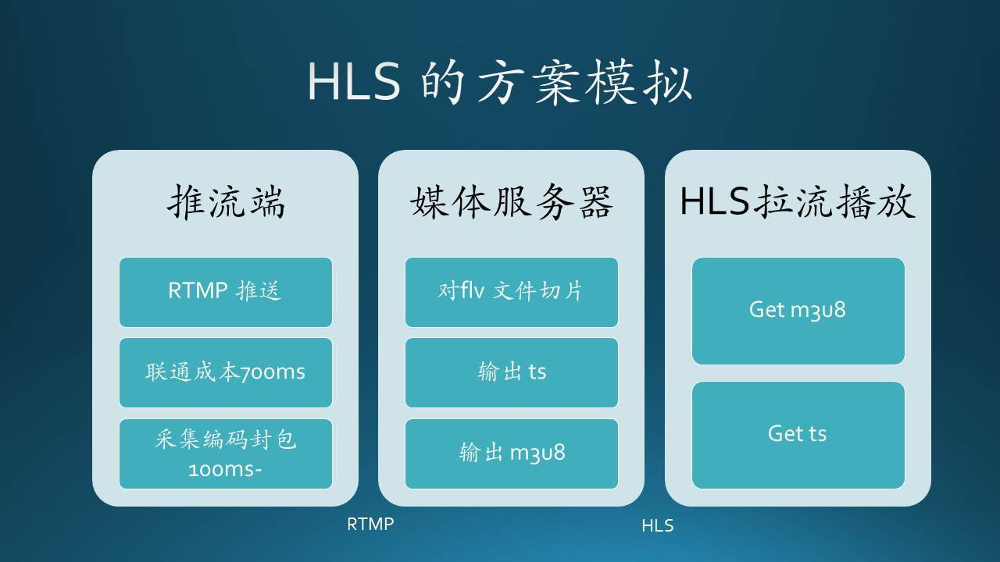
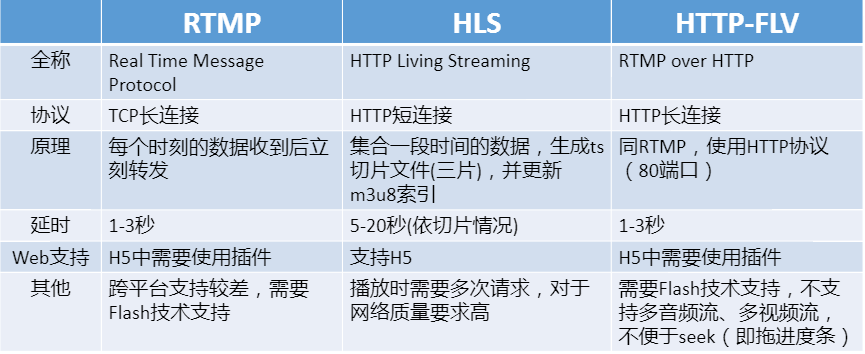
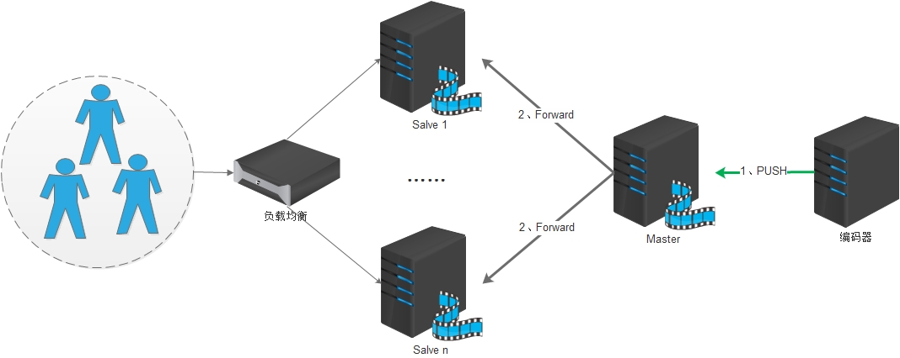

# about-multimedia
## 有关多媒体与直播

## 多媒体知识
### 基本概念
- 媒体文件和编码的区别

	文件是既包括视频又包括音频、甚至还带有脚本的一个集合，也可以叫容器；文件当中的视频和音频的压缩算法才是具体的编码。

- 

常见的音频视频编码

	- MPEG 系列：（由ISO[国际标准组织机构]下属的MPEG[运动图象专家组]开发）
		- 视频编码方面主要是Mpeg1（vcd 用的就是它）、Mpeg2（DVD 使用）、Mpeg4（现在的DVDRIP 使用的都是它的变种，如：divx，xvid 等）、Mpeg4 AVC（现在正热门）；
		- 音频编码方面主要是MPEG Audio Layer 1/2、MPEG Audio Layer 3（大名鼎鼎的mp3）、MPEG-2 AAC 、MPEG-4 AAC等等。注意：DVD音频没有采用Mpeg
	- H.26X系列（由ITU[国际电传视讯联盟]主导，侧重网络传输，注意：只是视频编码）
		- 包括H261、H262、H263、H263+、H263++、H264（就是MPEG4 AVC-合作的结晶）
	- 微软windows media系列
		- 视频编码有Mpeg-4 v1/v2/v3（基于MPEG4）、Windows Media Video 7/8/9/10
		- 音频编码有Windows Media audeo v1/v2/7/8/9
	- Real Media系列
		- 视频编码有RealVideo G2（早期）、RealVideo 8/9/10
		- 音频编码有RealAudio cook/sipro（早期）、RealAudio AAC/AACPlus等
	- QuickTime系列
		- 视频编码有Sorenson Video 3（用于QT5，成标准了）、Apple MPEG-4、Apple H.264
		- 音频编码有QDesign Music 2、Apple MPEG-4 AAC

- 

常见的文件格式（容器）

	- AVI，音视频交互存储，最常见的音频视频容器。支持的视频音频编码也是最多的；
	- MPG，MPEG编码采用的音频视频容器，具有流的特性，里面又分为PS，TS 等，PS主要用于DVD存储，TS主要用于HDTV；
	- VOB，DVD采用的音频视频容器格式（即视频MPEG-2，音频用AC3 或者DTS），支持多视频多音轨多字幕章节等；
	- MP4，MPEG-4 编码采用的音频视频容器，基于QuickTime MOV开发，具有许多先进特性；
	- 3GP，3GPP 视频采用的格式，主要用于流媒体传送；
	- ASF，Windows Media 采用的音频视频容器，能够用于流传送，还能包容脚本等；
	- RM，RealMedia 采用的音频视频容器，用于流传送；RMVB，是视频编码部分采用可变码率压缩的文件格式（容器）；
	- MOV，QuickTime 的音频视频容器；
	- MKV，它能把Windows Media Video，RealVideo，MPEG-4 等视频音频融为一个文件，而且支持多音轨，支持章节字幕等；
	- WAV，一种音频容器（注意：只是音频），大家常说的WAV就是没有压缩的PCM编码，其实WAV里面还可以包括MP3等其他ACM压缩编码；
	- MP3，MPEG Audio Layer 3（Mpeg 1 的音频编码的一种）文件转换（实际上也是编码转换）；

- IBP帧

	帧——就是影像动画中最小单位的单幅影像画面，相当于电影胶片上的每一格镜头。而在实际压缩时，会采取各种算法减少数据的容量，其中IPB就是最常见的。简单地说，I帧是关键帧，属于帧内压缩。P是向前搜索的意思。B是双向搜索。他们都是基于I帧来压缩数据。

	- I frame ：帧内编码帧 又称intra picture，关键帧。I 帧通常是每个 GOP（MPEG 所使用的一种视频压缩技术）
的第一个帧，视频序列中的第一个帧始终都是I帧。经过适度地压缩，I帧可以作为参考点来实现快进、快退以及其它
随机访问功能。帧可以看成是一个图像经过压缩后的产物，你可以理解为这一帧画面的完整保留。解码时只需要本帧
数据就可以完成（因为包含完整画面）。
	- P frame: 前向预测编码帧 又称predictive-frame，也叫预测帧。它表示的是这一帧跟之前的一个关键帧（或P帧）
的差别，解码时需要用之前缓存的画面叠加上本帧定义的差别，生成最终画面。（也就是差别帧，P帧没有完整画面数
据，只有与前一帧的画面差别的数据）
	- B frame: 双向预测内插编码帧 又称bi-directional interpolated prediction frame，也叫双向预测帧；也就
是B帧记录的是本帧与前后帧的差别（具体比较复杂，有4种情况），换言之，要解码B帧，不仅要取得之前的缓存画面，
还要解码之后的画面，通过前后画面的与本帧数据的叠加取得最终的画面。B帧压缩率高，但是解码时CPU会比较累~。
	- PTS：Presentation Time Stamp。PTS主要用于度量解码后的视频帧什么时候被显示出来
	- DTS：Decode Time Stamp。DTS主要是标识读入内存中的bit流在什么时候开始送入解码器中进行解码。在没有B帧存在的情况下DTS的顺序和PTS的顺序应该是一样的。
	- DTS和PTS区别：
		- DTS主要用于视频的解码,在解码阶段使用.PTS主要用于视频的同步和输出.在display的时候使用.在没有B frame的情
况下.DTS和PTS的输出顺序是一样的
	- IPB帧的不同
		- I frame：自身可以通过视频解压算法解压成一张单独的完整的图片
		- P frame：需要参考其前面的一个I frame 和/或 P frame来生成一张完整的图片
		- B frame：则要参考其前一个I或者P帧及其后面的一个P帧来生成一张完整的图片
		- 两个I frame之间形成一个GOP，在x264中同时可以通过参数来设定bf的大小，即：I 和p或者两个P之间B的数量。
        - 通过上述基本可以说明如果有B frame存在的情况下一个GOP的最后一个frame一定是P，所以如果视频流只有I和P，解码器可以不管后面的数据，边读边解码，线性前进

   

   

### RTSP协议
- RTSP+(RTCP/RTP)三者关系
  - 

### 案例一：vlc播放动画片，rtsp://184.72.239.149/vod/mp4:BigBuckBunny_115k.mov

- Wireshark抓取RTSP流+(RTCP/RTP基于UDP)过程

  - 

- 

RTSP协议交互过程

	OPTIONS rtsp://184.72.239.149:554/vod/mp4:BigBuckBunny_115k.mov RTSP/1.0
	CSeq: 2
	User-Agent: LibVLC/3.0.6 (LIVE555 Streaming Media v2016.11.28)
	
	RTSP/1.0 200 OK
	CSeq: 2
	Server: Wowza Streaming Engine 4.7.5.01 build21752
	Cache-Control: no-cache
	Public: DESCRIBE, SETUP, TEARDOWN, PLAY, PAUSE, OPTIONS, ANNOUNCE, RECORD, GET_PARAMETER
	Supported: play.basic, con.persistent
	
	DESCRIBE rtsp://184.72.239.149:554/vod/mp4:BigBuckBunny_115k.mov RTSP/1.0
	CSeq: 3
	User-Agent: LibVLC/3.0.6 (LIVE555 Streaming Media v2016.11.28)
	Accept: application/sdp
	
	RTSP/1.0 200 OK
	CSeq: 3
	Server: Wowza Streaming Engine 4.7.5.01 build21752
	Cache-Control: no-cache
	Expires: Tue, 26 Mar 2019 02:22:23 UTC
	Content-Length: 587
	Content-Base: rtsp://184.72.239.149:554/vod/mp4:BigBuckBunny_115k.mov/
	Date: Tue, 26 Mar 2019 02:22:23 UTC
	Content-Type: application/sdp
	Session: 310018309;timeout=60
	
	v=0
	o=- 310018309 310018309 IN IP4 184.72.239.149
	s=BigBuckBunny_115k.mov
	c=IN IP4 184.72.239.149
	t=0 0
	a=sdplang:en
	a=range:npt=0- 596.48
	a=control:*
	m=audio 0 RTP/AVP 96
	a=rtpmap:96 mpeg4-generic/12000/2
	a=fmtp:96 profile-level-id=1;mode=AAC-hbr;sizelength=13;indexlength=3;indexdeltalength=3;config=1490
	a=control:trackID=1
	m=video 0 RTP/AVP 97
	a=rtpmap:97 H264/90000
	a=fmtp:97 packetization-mode=1;profile-level-id=42C01E;sprop-parameter-sets=Z0LAHtkDxWhAAAADAEAAAAwDxYuS,aMuMsg==
	a=cliprect:0,0,160,240
	a=framesize:97 240-160
	a=framerate:24.0
	a=control:trackID=2
	SETUP rtsp://184.72.239.149:554/vod/mp4:BigBuckBunny_115k.mov/trackID=1 RTSP/1.0
	CSeq: 4
	User-Agent: LibVLC/3.0.6 (LIVE555 Streaming Media v2016.11.28)
	Transport: RTP/AVP;unicast;client_port=54286-54287
	
	RTSP/1.0 200 OK
	CSeq: 4
	Server: Wowza Streaming Engine 4.7.5.01 build21752
	Cache-Control: no-cache
	Expires: Tue, 26 Mar 2019 02:22:23 UTC
	Transport: RTP/AVP;unicast;client_port=54286-54287;source=184.72.239.149;server_port=8432-8433;ssrc=389A31E5
	Date: Tue, 26 Mar 2019 02:22:23 UTC
	Session: 310018309;timeout=60
	
	SETUP rtsp://184.72.239.149:554/vod/mp4:BigBuckBunny_115k.mov/trackID=2 RTSP/1.0
	CSeq: 5
	User-Agent: LibVLC/3.0.6 (LIVE555 Streaming Media v2016.11.28)
	Transport: RTP/AVP;unicast;client_port=54288-54289
	Session: 310018309
	
	RTSP/1.0 200 OK
	CSeq: 5
	Server: Wowza Streaming Engine 4.7.5.01 build21752
	Cache-Control: no-cache
	Expires: Tue, 26 Mar 2019 02:22:23 UTC
	Transport: RTP/AVP;unicast;client_port=54288-54289;source=184.72.239.149;server_port=16626-16627;ssrc=4B70664B
	Date: Tue, 26 Mar 2019 02:22:23 UTC
	Session: 310018309;timeout=60
	
	PLAY rtsp://184.72.239.149:554/vod/mp4:BigBuckBunny_115k.mov/ RTSP/1.0
	CSeq: 6
	User-Agent: LibVLC/3.0.6 (LIVE555 Streaming Media v2016.11.28)
	Session: 310018309
	Range: npt=0.000-
	
	RTSP/1.0 200 OK
	RTP-Info: url=rtsp://184.72.239.149:554/vod/mp4:BigBuckBunny_115k.mov/trackID=1;seq=1;rtptime=0,url=rtsp://184.72.239.149:554/vod/mp4:BigBuckBunny_115k.mov/trackID=2;seq=1;rtptime=0
	CSeq: 6
	Server: Wowza Streaming Engine 4.7.5.01 build21752
	Cache-Control: no-cache
	Range: npt=0.0-596.48
	Session: 310018309;timeout=60
	
	PAUSE rtsp://184.72.239.149:554/vod/mp4:BigBuckBunny_115k.mov/ RTSP/1.0
	CSeq: 7
	User-Agent: LibVLC/3.0.6 (LIVE555 Streaming Media v2016.11.28)
	Session: 310018309
	
	RTSP/1.0 200 OK
	CSeq: 7
	Server: Wowza Streaming Engine 4.7.5.01 build21752
	Cache-Control: no-cache
	Session: 310018309;timeout=60
	
	PLAY rtsp://184.72.239.149:554/vod/mp4:BigBuckBunny_115k.mov/ RTSP/1.0
	CSeq: 8
	User-Agent: LibVLC/3.0.6 (LIVE555 Streaming Media v2016.11.28)
	Session: 310018309
	Range: npt=37.220-
	
	RTSP/1.0 200 OK
	RTP-Info: url=rtsp://184.72.239.149:554/vod/mp4:BigBuckBunny_115k.mov/trackID=1;seq=113;rtptime=445440,url=rtsp://184.72.239.149:554/vod/mp4:BigBuckBunny_115k.mov/trackID=2;seq=296;rtptime=3340800
	CSeq: 8
	Server: Wowza Streaming Engine 4.7.5.01 build21752
	Cache-Control: no-cache
	Range: npt=37.22-596.48
	Session: 310018309;timeout=60
	
	PAUSE rtsp://184.72.239.149:554/vod/mp4:BigBuckBunny_115k.mov/ RTSP/1.0
	CSeq: 9
	User-Agent: LibVLC/3.0.6 (LIVE555 Streaming Media v2016.11.28)
	Session: 310018309
	
	RTSP/1.0 200 OK
	CSeq: 9
	Server: Wowza Streaming Engine 4.7.5.01 build21752
	Cache-Control: no-cache
	Session: 310018309;timeout=60
	
	PLAY rtsp://184.72.239.149:554/vod/mp4:BigBuckBunny_115k.mov/ RTSP/1.0
	CSeq: 10
	User-Agent: LibVLC/3.0.6 (LIVE555 Streaming Media v2016.11.28)
	Session: 310018309
	Range: npt=121.921-
	
	RTSP/1.0 200 OK
	RTP-Info: url=rtsp://184.72.239.149:554/vod/mp4:BigBuckBunny_115k.mov/trackID=1;seq=119;rtptime=1464324,url=rtsp://184.72.239.149:554/vod/mp4:BigBuckBunny_115k.mov/trackID=2;seq=316;rtptime=10982430
	CSeq: 10
	Server: Wowza Streaming Engine 4.7.5.01 build21752
	Cache-Control: no-cache
	Range: npt=121.921-596.48
	Session: 310018309;timeout=60
	
	PAUSE rtsp://184.72.239.149:554/vod/mp4:BigBuckBunny_115k.mov/ RTSP/1.0
	CSeq: 11
	User-Agent: LibVLC/3.0.6 (LIVE555 Streaming Media v2016.11.28)
	Session: 310018309
	
	RTSP/1.0 200 OK
	CSeq: 11
	Server: Wowza Streaming Engine 4.7.5.01 build21752
	Cache-Control: no-cache
	Session: 310018309;timeout=60
	
	PLAY rtsp://184.72.239.149:554/vod/mp4:BigBuckBunny_115k.mov/ RTSP/1.0
	CSeq: 12
	User-Agent: LibVLC/3.0.6 (LIVE555 Streaming Media v2016.11.28)
	Session: 310018309
	Range: npt=197.793-
	
	RTSP/1.0 200 OK
	RTP-Info: url=rtsp://184.72.239.149:554/vod/mp4:BigBuckBunny_115k.mov/trackID=1;seq=143;rtptime=2363388,url=rtsp://184.72.239.149:554/vod/mp4:BigBuckBunny_115k.mov/trackID=2;seq=388;rtptime=17725410
	CSeq: 12
	Server: Wowza Streaming Engine 4.7.5.01 build21752
	Cache-Control: no-cache
	Range: npt=197.793-596.48
	Session: 310018309;timeout=60
	
	TEARDOWN rtsp://184.72.239.149:554/vod/mp4:BigBuckBunny_115k.mov/ RTSP/1.0
	CSeq: 13
	User-Agent: LibVLC/3.0.6 (LIVE555 Streaming Media v2016.11.28)
	Session: 310018309

## 直播技术和SRS开源直播平台

SRS与其他直播平台对比

## SRS分析

解析命令选项

- do_main
	- SrsConfig::parse_options
		- SrsConfig::parse_argv，解析命令行选项
		- parse_file，解析配置文件"listen"、"http_server"、"daemon"、"srs_log_tank"部分

协程管理

- st_thread_create，创建协程
	- SrsSTCoroutine::pfn
		- SrsSTCoroutine::cycle
			- handler->cycle，此处handler为创建SrsSTCoroutine对象时传入的第二个参数对象，必需继承至ISrsCoroutineHandler且实现cycle函数

信号管理

监听管理

连接管理

关键流程

- run_master

	- SrsServer::listen
		- listen_rtmp，推流（rtmp）到srs
			- 创建SrsBufferListener对象，并listen
				- 创建SrsTcpListener对象，并listen
					- 调用套接口监听
					- 创建“tcp” SrsSTCoroutine对象
					- 调用start
						- st_thread_create，启动协程SrsSTCoroutine::pfn
						- **SrsSTCoroutine::pfn，独立协程**
							- SrsSTCoroutine::cycle
								- handler->cycle()，此处handler为SrsTcpListener对象，实际调用SrsTcpListener::cycle
									- handler->on_tcp_client，此处handler为SrsBufferListener对象，实际调用SrsBufferListener::on_tcp_client
										- server->accept_client，实际调用SrsServer::accept_client
											- fd2conn
												- type == SrsListenerRtmpStream，创建SrsRtmpConn对象
											- conn->start，实际调用SrsRtmpConn父类SrsConnection::start
												- trd->start，实际调用SrsSTCoroutine::start
													- SrsConnection::cycle
														- SrsRtmpConn::do_cycle，rtmp协议处理
	- SrsServer::ingest
		- SrsIngester::start
			- 创建“tcp” SrsSTCoroutine对象
			- 调用start
				- st_thread_create，启动协程SrsSTCoroutine::pfn
				- **SrsSTCoroutine::pfn，独立协程**
					- SrsSTCoroutine::cycle
						- handler->cycle()，此处handler为SrsIngester对象，实际调用SrsIngester::cycle
							- SrsIngester::do_cycle
								- SrsIngester::parse，解析配置文件
									- SrsIngester::parse_ingesters，遍历所有vhost，并调用该函数解析配置文件“ingest”部分
										- 如果“enabled”部分“off”则退出，否则继续；
										- 如果“ffmpeg”为空退出，否则继续；
										- SrsIngester::parse_engines，遍历所有“engine”，根据“engine”是否为空，创建不同的ingester采集器对象（属于SrsIngesterFFMPEG类）
											- SrsIngester::initialize_ffmpeg，解析配置文件“engine”、“input”部分，为ffmpeg做准备同时根据vhost，port信息生成完整的rtmp地址
								- **遍历所有的ingest对象**
									- SrsIngesterFFMPEG::start，拼接命令选项并创建进程
										- SrsFFMPEG::start
											- SrsProcess::initialize，拼接采集器命令选项
											- SrsProcess::start，创建采集器进程
									- SrsIngesterFFMPEG::cycle，收集采集器运行状态
										- SrsFFMPEG::cycle
											- SrsProcess::cycle，获取采集器状态
	- SrsServer::cycle
		- SrsServer::do_cycle
			- handler->on_cycle，循环调用
	- listen\_http_api
	- listen\_http_stream
	- listen\_stream_caster，推流（非rtmp）到srs，输出rtmp，对应配置文件“stream_caster”和“caster”部分
		- rtsp caster（**Push RTSP to SRS**）
			- 创建SrsRtspListener对象（内部创建SrsRtspCaster对象，赋给caster）
				- 创建SrsTcpListener对象，并listen
					- 调用套接口监听
					- 创建“tcp” SrsSTCoroutine对象
					- 调用start
						- st_thread_create，启动协程SrsSTCoroutine::pfn
							- **SrsSTCoroutine::pfn，独立协程**
								- p->cycle，实际调用SrsTcpListener::cycle
									- handler->on_tcp_client，实际调用SrsRtspListener::on_tcp_client
										- caster->on_tcp_client，实际调用SrsRtspCaster::on_tcp_client
											- 创建SrsRtspConn对象，并serve
												- SrsConnection::cycle
													- SrsRtspConn::cycle
														- SrsRtspConn::do_cycle，rtsp协议处理
		- flv caster（**Push HTTP FLV to SRS**）
			- 创建SrsHttpFlvListener对象（内部创建SrsAppCasterFlv对象，赋给caster）
				- 创建SrsTcpListener对象，并listen
					- 调用套接口监听
					- 创建“tcp” SrsSTCoroutine对象
					- 调用start
						- st_thread_create，启动协程SrsSTCoroutine::pfn
							- **SrsSTCoroutine::pfn，独立协程**
								- p->cycle，实际调用SrsTcpListener::cycle
									- handler->on_tcp_client，实际调用SrsHttpFlvListener::on_tcp_client
										- caster->on_tcp_client，实际调用SrsAppCasterFlv::on_tcp_client
											- 创建SrsDynamicHttpConn对象
											- 调用start
												- conn->start，实际调用SrsDynamicHttpConn父类SrsConnection::start
												- trd->start，实际调用SrsSTCoroutine::start
													- SrsConnection::cycle
														- SrsHttpConn::do_cycle，http协议处理
															- on_got_http_message
																- SrsAppCasterFlv::serve_http
		- mpegts\_over_udp（**Push MPEG-TS over UDP**）
			- 创建SrsUdpCasterListener对象（内部创建SrsMpegtsOverUdp对象）
				- 创建SrsUdpListener对象，并listen
					- 创建套接口
					- 创建“udp” SrsSTCoroutine对象
					- 调用start
					- st_thread_create，启动协程SrsSTCoroutine::pfn
							- **SrsSTCoroutine::pfn，独立协程**
								- p->cycle，实际调用SrsUdpListener::cycle
									- handler->on_udp_packet，实际调用SrsMpegtsOverUdp::on_udp_packet
										- context->decode，解码ts包
		

### Ingest采集方式 ###
  采集(Ingest)指的是将文件（flv，mp4，mkv，avi，rmvb等等），流（RTMP，RTMPT，RTMPS，RTSP，HTTP，HLS等等），设备等的数据，转封装为RTMP流（若编码不是h264/aac则需要转码），推送到SRS

  采集的主要应用场景包括：

1. 虚拟直播：      
  将文件编码为直播流。可以指定多个文件后，SRS会循环播放。

2. RTSP摄像头对接：
  以前安防摄像头都支持访问RTSP地址，RTSP无法在互联网播放。
  可以将RTSP采集后，以RTMP推送到SRS，后面的东西就不用讲了。
3. 直接采集设备：  
  SRS采集功能可以作为编码器采集设备上的未压缩图像数据，
  譬如video4linux和alsa设备，编码为h264/aac后输出RTMP到SRS。
4. 将HTTP流采集为RTMP：
  有些老的设备，能输出HTTP的ts或FLV流，可以采集后转封装为RTMP，支持HLS输出。

  总之，采集的应用场景主要是“SRS拉流”；能拉任意的流，只要ffmpeg支持；不是h264/aac都没有关系，ffmpeg能转码。

### Forward集群模式

Master节点关键流程

- SrsForwarder::cycle
  - SrsForwarder::do_cycle
    - srs_parse_hostport，解析ip和port
    - srs_generate_rtmp_url，生成rtmp地址
    - new SrsSimpleRtmpClient，创建了SrsSimpleRtmpClient对象
    - 调用connect，内部创建了tcp对象和rtmp对象
      - client->handshake，跟Slave握手
      - connect_app，建立连接
      - client->create_stream，创建流
    - 调用publish，处理编码器推流rtmp
    - 调用on_forwarder_start，缓存音视频数据
    - 调用forward，真正发送音视频数据给slave 

### Edge集群模式

## 有关Nginx高性能服务器

## 资料汇总
1. [ONVIF 2.0 Service Operation Index](https://www.onvif.org/onvif/ver20/util/operationIndex.html)
2. [rfc2326 - Real Time Streaming Protocol (RTSP)](https://tools.ietf.org/html/rfc2326)
2. [rfc3550 - RTP: A Transport Protocol for Real-Time Applications](https://tools.ietf.org/html/rfc3550)
3. [rfc3551 - RTP Profile for Audio and Video Conferences with Minimal Control](https://tools.ietf.org/html/rfc3551)
4. [rfc3611 - RTP Control Protocol Extended Reports (RTCP XR)](https://tools.ietf.org/html/rfc3611)
5. [rfc3711 - The Secure Real-time Transport Protocol (SRTP)](https://tools.ietf.org/html/rfc3711)
6. [rfc4585 - Extended RTP Profile for Real-time Transport Control Protocol (RTCP)-Based Feedback (RTP/AVPF)](https://tools.ietf.org/html/rfc4585)
7. [rfc4566 - SDP: Session Description Protocol](https://tools.ietf.org/html/rfc4566)
8. [rfc5104 - Codec Control Messages in the RTP Audio-Visual Profile with Feedback (AVPF)](https://tools.ietf.org/html/rfc5104)
9. [rfc5124 - Extended Secure RTP Profile for Real-time Transport Control Protocol (RTCP)-Based Feedback (RTP/SAVPF)](https://tools.ietf.org/html/rfc5124)
10. [rfc5450 - Transmission Time Offsets in RTP Streams](https://tools.ietf.org/html/rfc5450)
11. [rfc6184 - RTP Payload Format for H.264 Video](https://tools.ietf.org/html/rfc6184)
12. [rfc7741 - RTP Payload Format for VP8 Video](https://tools.ietf.org/html/rfc7741)
13. [rfc8216 - HTTP Live Streaming](https://tools.ietf.org/html/rfc8216)
14. [RTMP WIKI](https://en.wikipedia.org/wiki/Real-Time_Messaging_Protocol)
15. [rtmp specification v1.0](http://wwwimages.adobe.com/www.adobe.com/content/dam/acom/en/devnet/rtmp/pdf/rtmp_specification_1.0.pdf)
16. [HLS WIKI](https://en.wikipedia.org/wiki/HTTP_Live_Streaming)
17. [北京大学，视频编码算法研究室](http://vcl.idm.pku.edu.cn/articlesList.html?tag=research&page=0)
18. [流媒体加密](https://github.com/gwuhaolin/blog/issues/10)
19. [使用flv.js做直播](https://github.com/gwuhaolin/blog/issues/3)
20. [雷霄骅 - RGB、YUV像素数据处理](https://blog.csdn.net/leixiaohua1020/article/details/50534150)
21. [雷霄骅 - H.264视频码流解析](https://blog.csdn.net/leixiaohua1020/article/details/50534369) 
22. [雷霄骅 - h264_analysis](https://github.com/leixiaohua1020/h264_analysis)
23. [雷霄骅 - PCM音频采样数据处理](https://blog.csdn.net/leixiaohua1020/article/details/50534316)
24. [雷霄骅 - AAC音频码流解析](https://blog.csdn.net/leixiaohua1020/article/details/50535042)
25. [雷霄骅 - FLV封装格式解析](https://blog.csdn.net/leixiaohua1020/article/details/50535082)
26. [雷霄骅 - UDP-RTP协议解析](https://blog.csdn.net/leixiaohua1020/article/details/50535230)
27. [雷霄骅 - ffmpeg源码简析（一）结构总览](https://blog.csdn.net/king1425/article/details/70597642/)
